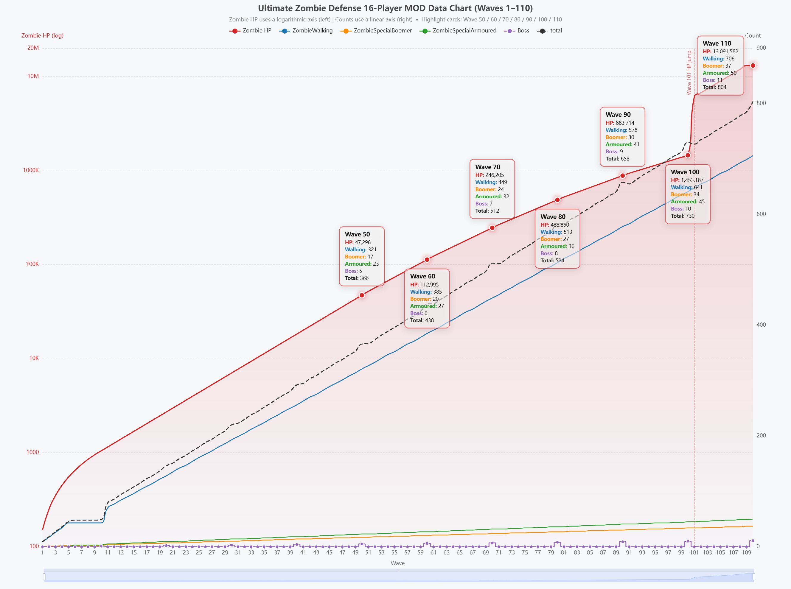

# 🧟 Ultimate Zombie Defense [16-Player MOD]

Language: English | [中文](README.zh-CN.md)

> A powerful multiplayer MOD that enhances gameplay with scaling difficulty, massive buffs, and balanced progression for up to 16 players.

---

## 📖 Overview

- Supports up to **16 online players** simultaneously.
- Round difficulty **automatically scales** according to the number of players in the room.
- Player attributes are fully enhanced while zombie strength is precisely balanced, ensuring both challenge and fairness.

---

## 📊 Game Balance & Difficulty Curve



*The chart shows zombie HP (logarithmic axis) and zombie counts (linear axis) across Waves 1–110, demonstrating the smooth difficulty progression designed by this MOD.*

---

## 💎 Player Buffs & Enhancements

### 1. Compound Growth (Every 5 Rounds)

All of the following attributes gain a **+5% cumulative boost every 5 rounds**:

- Player Health & Armor
- Most Skill Tree attributes
- All Weapons (Damage / Fire Rate / Reload Speed / Magazine Capacity / Total Ammo)
- All Structures (Durability / Attack Damage)
- Resources (Gold / Experience Gain)

### 2. Equipment Boosts

| Item | Boost |
|------|-------|
| Special Weapons | ×4 Damage |
| Rocket Launcher | ×16 Magazine & Total Ammo |
| Flamethrower / Grenade Launcher | ×4 Magazine & Total Ammo |
| Armor | ×2 Armor Strength & Damage Reduction |

### 3. Building & Defense Boosts

| Item | Boost |
|------|-------|
| Mines & Oil Barrels | ×4 Damage |
| Autocannons | ×4 Magazine & Total Ammo |
| Barbed Wire, Medkits, Ammo Crates | ×4 Structure Durability |
| Autocannons, Laser Fences, Tesla Towers, Terminator Towers | ×2 Structure Durability |
| Medkits | ×4 Healing Speed |

### 4. Skill Tree Upgrades

| Skill Path | Upgrade |
|------------|---------|
| Heavy - Berserker | Doubled trigger threshold & damage output |
| Medic - Invincibility | Doubled invincibility duration |
| Specialist - Critical Strike | Doubled critical chance & critical damage |
| Engineer | High-voltage Barbed Wire and Autocannon damage doubled |

---

## 🧟 Zombie Balance & Game Progression

- Early-game difficulty is identical to the official vanilla version; mid & late-game difficulty growth is significantly smoothed.
- **Round 100** is set as the official clear round for this MOD.
- After clearing Round 100, vanilla difficulty will be restored. The official maximum round limit is **Round 110**.
- There are **Easter eggs** for completing rounds 100 and 110 in MOD.
- This MOD adds randomness to non-BOSS turns to **accelerate the game**.
- **Weapon Damage Leaderboard** updates every 2 rounds.
- **Kill Count Leaderboard** updates every 5 rounds.

---

## ⚙️ MOD Installation & Usage Tips

### Installation Guide

1. Extract the ZIP archive.
2. Copy the `UltimateZombieDefense_64_Data` folder into your game root directory and overwrite existing files.

**Alternatively**, manually replace the following file:

```
./UltimateZombieDefense_64_Data/Managed/Assembly-CSharp.dll
```

### Network Recommendation

> This MOD is intended for use in domestic/local multiplayer. It is not recommended to use a network accelerator to avoid high latency, unless you are playing with overseas players.

---

## 🔗 Resources

- Full MOD introduction, free download, and feedback: [UltimateZombieDefenseMOD](https://github.com/Teplines/UltimateZombieDefenseMOD.git)

---

## 📄 License

This MOD is shared for free and intended for personal and non-commercial use. Please adhere to the terms of service provided by the original game developer.
