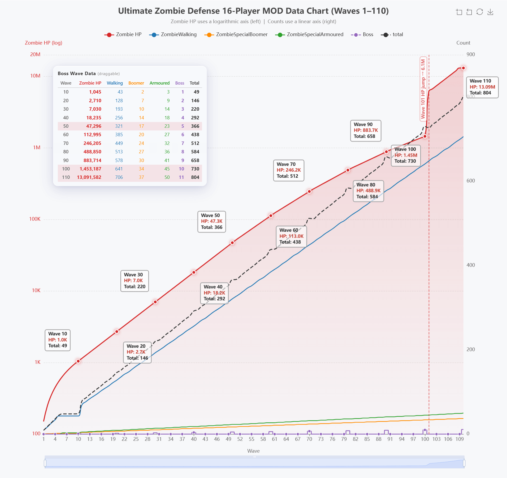

# 🧟 Ultimate Zombie Defense [16-Player SPEEDRUN MOD]

Language: English | [中文](README.zh-CN.md)

> A powerful multiplayer speedrun MOD that delivers a richer experience for up to 16 players through difficulty scaling, significant buffs, and a balanced progression system.

---

## 📖 Overview

- Supports up to **16 online players** simultaneously.
- Wave difficulty **automatically scales** based on the number of players in the room.
- Player attributes are significantly enhanced while zombie strength is carefully balanced, creating a challenge that remains fair.

---

## 📊 Game Balance & Data Chart



*This chart shows zombie HP (logarithmic axis) and zombie count (linear axis) across Waves 1–110, illustrating the smooth difficulty progression designed by this MOD.*

---

## 💎 Player Buffs & Enhancements

### 1. Compound Growth (Every 5 Waves)

The following attributes receive a **+5% cumulative boost every 5 waves**:

- Player health and armor
- Most skill tree attributes
- All weapons (damage / fire rate / reload speed / magazine capacity / total ammo)
- All structures (durability / attack damage)
- Resources (gold / experience gain)

### 2. Equipment Boosts

| Item | Boost |
|------|------|
| Primary Weapons | ×2 Damage |
| Special Weapons | ×4 Damage |
| All Weapons | ×2 Magazine Capacity / ×4 Total Ammo |
| Armor | ×2 Armor Strength and Damage Reduction |

### 3. Buildings & Defenses
| Item | Boost |
|------|------|
| Mines & Oil Barrels, Autocannons, Tesla Towers, Terminator Towers | ×4 Damage |
| Barbed Wire, Medkits, Ammo Crates | ×4 Structure Durability |
| Autocannons, Laser Fences, Tesla Towers, Terminator Towers | ×2 Structure Durability |
| Autocannons | ×4 Output Time |
| Medkits | ×4 Healing Speed |

### 4. Skill Tree Upgrades
| Skill Path | Effect |
|----------|--------|
| Heavy - Berserker | Trigger thresholds and damage output doubled |
| Medic - Invincibility | Invincibility duration doubled |
| Specialist - Critical | Critical chance and critical damage doubled |
| Engineer | Damage of high-voltage barbed wire and autocannon doubled |

---

## 🧟 Zombie Balance & Game Progression

- **Smooth difficulty curve:** Early waves stay close to the original game; mid- and late-game difficulty growth is smoothed.
- **Clear goal:** The MOD’s target clear is Wave 100. After that, vanilla difficulty resumes. The maximum is Wave 110 and the clear includes easter eggs.
- **Faster pacing:** Shortened waves and increased game speed.
- **Leaderboards:** Added leaderboards for weapon damage and kill counts.

---

## ⚙️ MOD Installation & Usage Suggestions

### Installation Guide

1. Extract the ZIP archive.
2. Copy the `UltimateZombieDefense_64_Data` folder into the game's root directory and overwrite existing files.

Or manually replace the following file:

```
./UltimateZombieDefense_64_Data/Managed/Assembly-CSharp.dll
```

### Network Recommendation

This MOD is suitable for domestic/local multiplayer. Avoid using network accelerators to prevent high latency unless you are connecting with overseas players.

---

## 🔗 Resources

- Full MOD introduction, free download, and feedback: [UltimateZombieDefenseMOD](https://github.com/Teplines/UltimateZombieDefenseMOD.git)

---

## 📄 License

This MOD is shared for free for personal and non-commercial use. Please follow the original game developer's terms of service.
